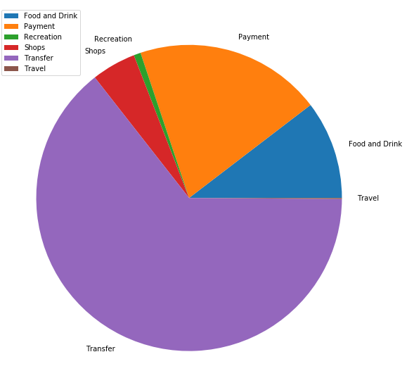
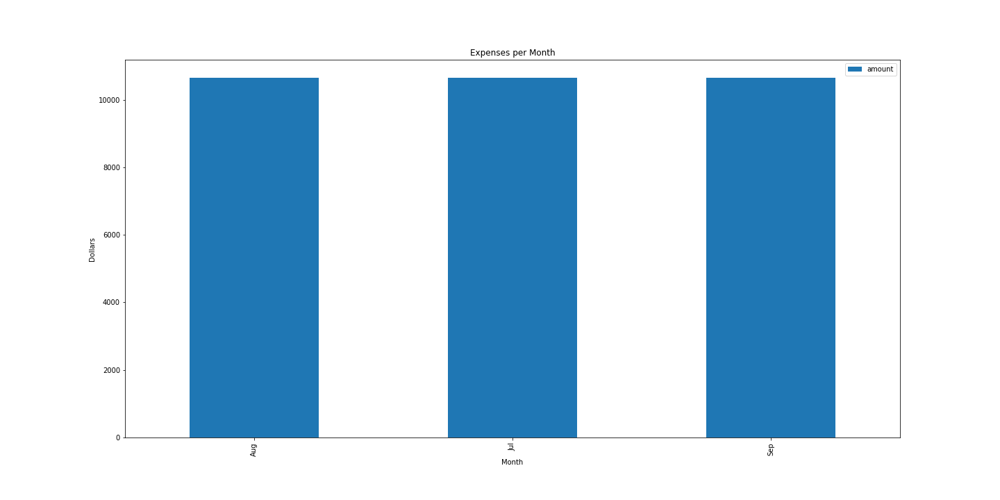
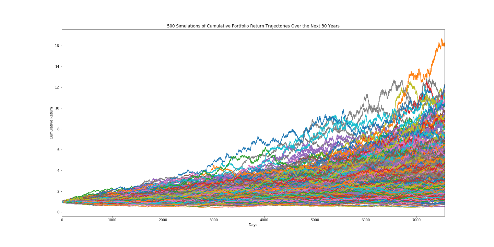
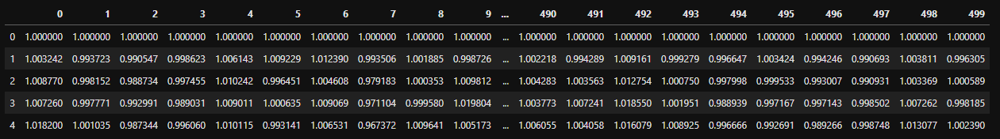
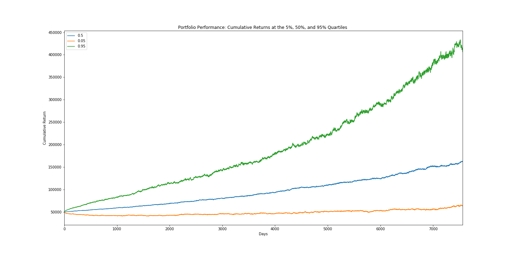

# Unit 5 — How do you like them apps?

## Budget Analysis

### Spending Per Category
| Category       |   Amount |
|:---------------|---------:|
| Food and Drink |  3817.19 |
| Payment        |  6310.50 |
| Recreation     |   235.50 |
| Shops          |  1500.00 |
| Transfer       | 20537.34 |
| Travel         |    35.19 |

### Spending Per Month
| Category   |   Amount |
|:-----------|---------:|
| Aug        | 10645.24 |
| Jul        | 10645.24 |
| Sep        | 10645.24 |

### Income Data From the Sandbox 
1. Previous year's gross income was $7285
2. Current monthly income is $500
3. Projected yearly income is $6085

## Retirement Planner

1.  Historical closing prices for a traditional 60/40 portfolio using the SPY and AGG tickers to represent the 60% stocks (SPY) and 40% bonds (AGG). First five rows of the data is as follows:

    | Date                |   SPY CLOSE |   AGG CLOSE |
    |:--------------------|------------:|------------:|
    | 2018-09-27 00:00:00 |         nan |         nan |
    | 2018-09-28 00:00:00 |    0.000103 |   -0.001041 |
    | 2018-10-01 00:00:00 |    0.003474 |   -0.002654 |
    | 2018-10-02 00:00:00 |   -0.000583 |    0.001140 |
    | 2018-10-03 00:00:00 |    0.000549 |   -0.004746 |

2. Monte Carlo Simulation of 500 runs and 30 years for the 60/40 portfolio and plot the results.

3. Ending cumulative returns from the 500 Monte Carlo simulation runs. 

4. Ending cumulative returns, histogram of the results with a 90% confidence interval as vertical lines on the histogram.

## Retirement Analysis

1. Expected cumulative returns at 30 years for the 10th, 50th, and 90th percentiles:

    | Percentile | Expected Cumulative Returns  | 
    |:--------------------|------------:
    | 10% |   1.526331 |
    | 50% |    3.514154|
    | 90% |    6.404143|  

2. An initial investment of $50,000 results in the following expected returns in dollars at 30 years for the 10th, 50th, and 90th percentiles:

    | Percentile | Expected Cumulative Returns  | 
    |:--------------------|------------:
    | 10% |      $76,316.57 |
    | 50% |      $17,5707.69|
    | 90% |      $32,0207.13|  

3. After 30 years a 4% withdrawl rate on a $50,000 initial investment yeilds $3,052, which is less than Plaid projected yearly income of $6,085.

4. A 50% increase in the initial investment after 30 years yeilds a 4% retirement withdrawal of $4,578.

5. Plot of cumulative returns at the 5%, 50%, and 95% quartiles over the 30 year life (x axis is in days) of the investment.

## Optional Challenge — Early Retirement
Adjusting the portfolio to  retire in 5 years instead of 30, would require an inital investment of $165,475.
